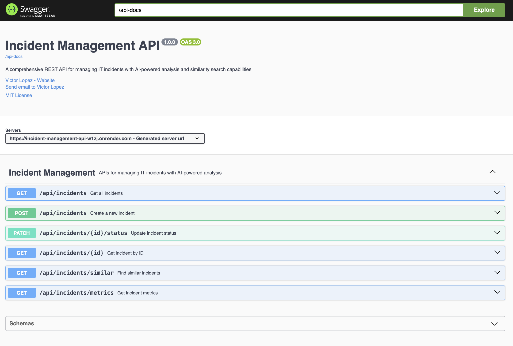
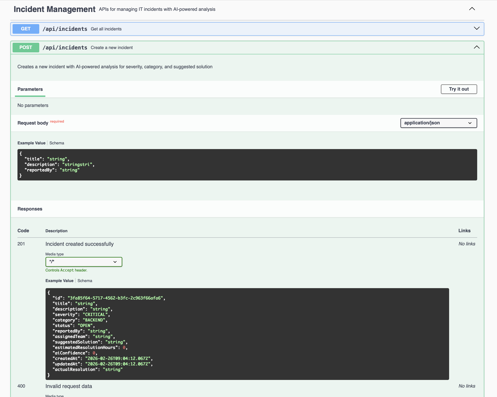
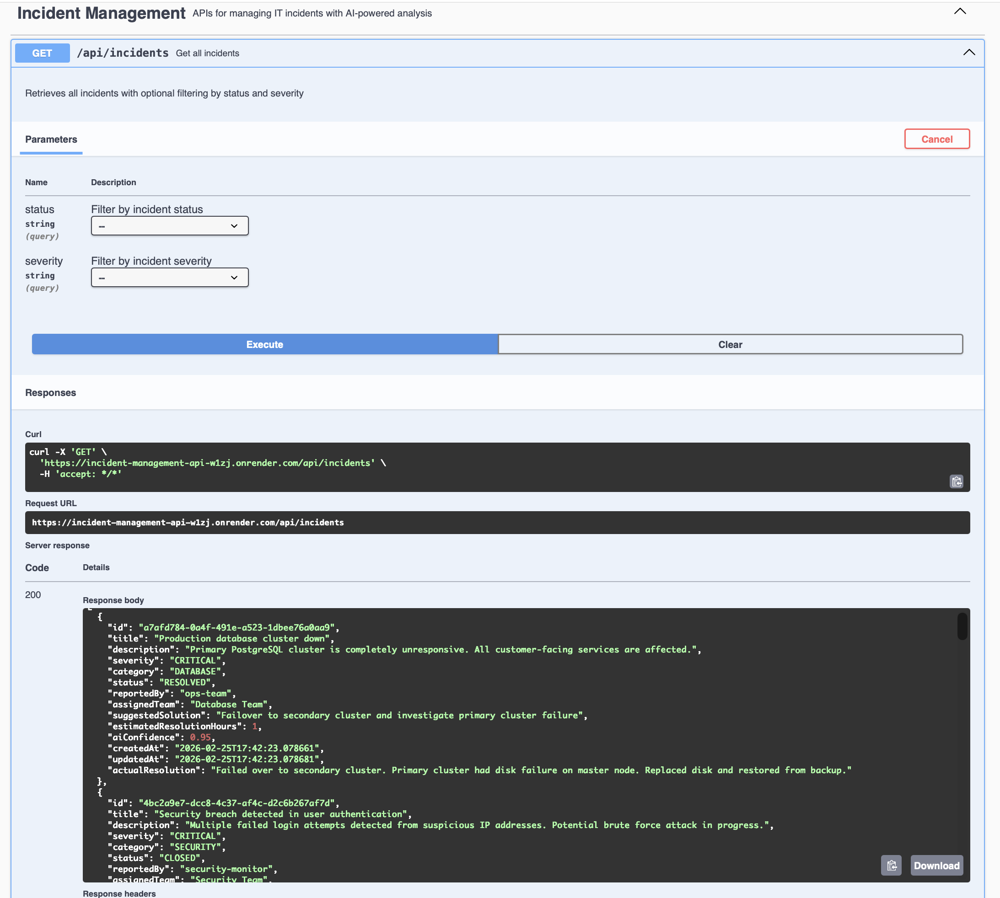
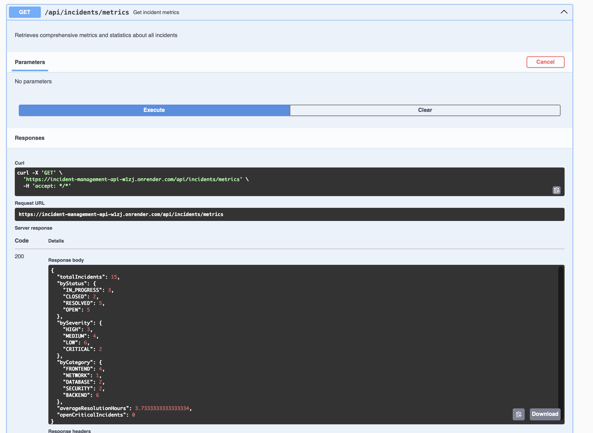
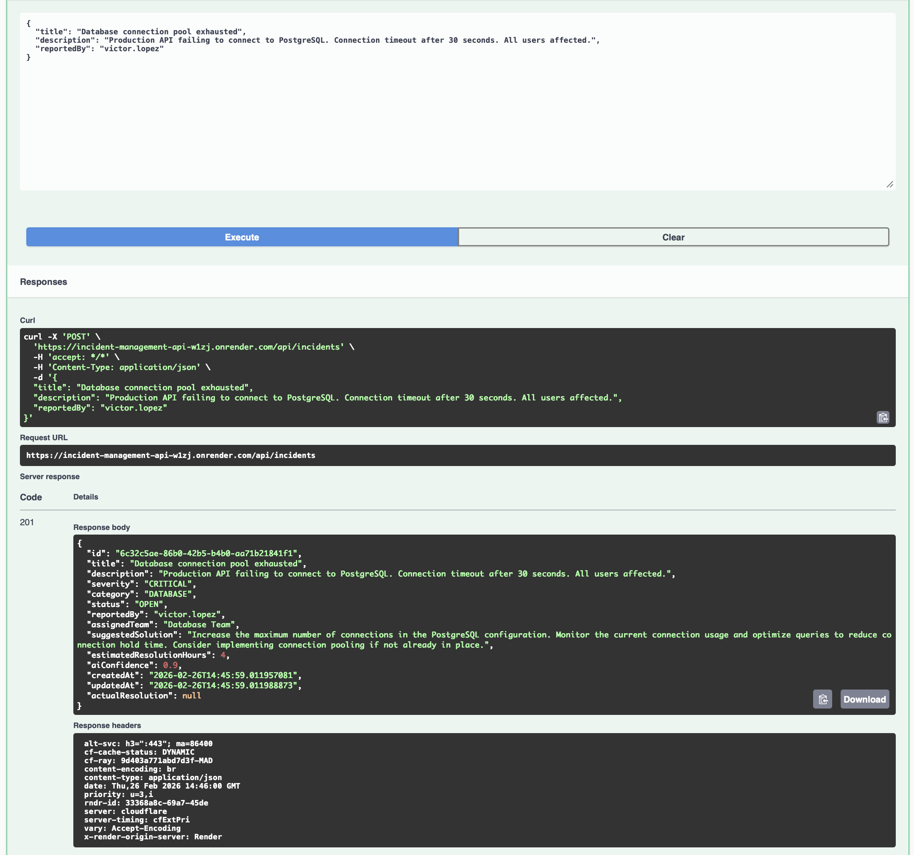

# 🚀 Incident Management API

> AI-powered REST API for technical incident management using Spring Boot and OpenAI

[](https://openjdk.org/)
[](https://spring.io/projects/spring-boot)
[](https://openai.com/)
[](https://www.postgresql.org/)
[](https://www.docker.com/)
[](https://incident-management-api-w1zj.onrender.com)
[](https://github.com/lopezviktor/incident-management-api/actions/workflows/ci.yml)

---

## 🌐 Live Demo

The API is deployed and publicly accessible on Render:

| Link | URL |
|------|-----|
| **API** | https://incident-management-api-w1zj.onrender.com/api/incidents |
| **Swagger UI** | https://incident-management-api-w1zj.onrender.com/swagger-ui.html |
| **Metrics** | https://incident-management-api-w1zj.onrender.com/api/incidents/metrics |
| **Health Check** | https://incident-management-api-w1zj.onrender.com/actuator/health |

> **Note**: The free tier on Render spins down after inactivity — the first request may take ~30 seconds to cold start.

---

## 📋 Table of Contents

- [Overview](#-overview)
- [Key Features](#-key-features)
- [Tech Stack](#-tech-stack)
- [Architecture](#-architecture)
- [Getting Started](#-getting-started)
- [API Endpoints](#-api-endpoints)
- [AI Integration](#-ai-integration)
- [Testing](#-testing)
- [Project Structure](#-project-structure)
- [Environment Variables](#-environment-variables)
- [Screenshots](#-screenshots)
- [Contributing](#-contributing)
- [License](#-license)

---

## 🎯 Overview

**Incident Management API** is a production-ready REST API designed to manage technical incidents in software systems. The standout feature is **automatic AI-powered analysis** using OpenAI's GPT-4o-mini model.

When an incident is created, the system automatically:
- 🔍 **Classifies severity** (CRITICAL, HIGH, MEDIUM, LOW)
- 📂 **Categorizes the incident** (BACKEND, FRONTEND, DATABASE, SECURITY, NETWORK)
- 👥 **Suggests the appropriate team** to handle it
- 💡 **Generates a solution recommendation** based on the incident description
- ⏱️ **Estimates resolution time** in hours
- 📊 **Provides a confidence score** (0.0 to 1.0)

### Why This Project?

This is a **portfolio project** built to demonstrate:
- Modern Spring Boot development practices
- Real-world AI integration (not just a tutorial)
- Test-Driven Development (TDD)
- Clean architecture principles (SOLID, DRY)
- Render deployment (production)
- Professional API design

---

## ✨ Key Features

### 🤖 AI-Powered Analysis
- Automatic incident classification using OpenAI GPT-4o-mini
- Context-aware severity and category detection
- Intelligent solution suggestions based on similar past incidents
- Confidence scoring for AI predictions

### 📊 Incident Management
- Create, read, update, and delete incidents
- Filter by status, severity, and category
- Track incident lifecycle (OPEN → IN_PROGRESS → RESOLVED → CLOSED)
- Store both AI-suggested and actual resolutions

### 📈 Metrics & Analytics
- Real-time dashboard metrics
- Count by status, severity, and category
- Average resolution time tracking
- Open critical incidents monitoring

### 🔐 JWT Authentication
- Register and login endpoints with BCrypt password hashing
- Stateless JWT tokens for secure API access
- Role-based access control (USER, ADMIN)
- Protected endpoints require `Authorization: Bearer <token>` header

### 🧪 Production-Ready
- Comprehensive test coverage (56 unit tests)
- Paginated API responses with configurable page size and sorting
- Database indexes on all frequently queried columns
- CORS configuration and tightened actuator exposure
- Docker Compose for easy local development
- Environment-based configuration
- Structured error handling with custom exceptions

---

## 🛠️ Tech Stack

| Layer | Technology | Purpose |
|-------|-----------|---------|
| **Backend** | Java 21, Spring Boot 3.4.2 | Core application framework |
| **AI** | Spring AI, OpenAI GPT-4o-mini | Incident analysis and classification |
| **Security** | Spring Security, JWT (jjwt 0.12.6) | Authentication and authorization |
| **Database** | PostgreSQL 16 | Persistent data storage |
| **ORM** | Spring Data JPA + Hibernate | Database abstraction |
| **Testing** | JUnit 5, Mockito, AssertJ | Unit and integration testing |
| **Containerization** | Docker, Docker Compose | Local development environment |
| **Build Tool** | Maven | Dependency management |

---

## 🏗️ Architecture

```
┌─────────────────────────────────────────────────────────────┐
│                      REST API Layer                         │
│                   (IncidentController)                      │
└────────────────────────┬────────────────────────────────────┘
                         │
                         ▼
┌─────────────────────────────────────────────────────────────┐
│                    Service Layer                            │
│  ┌──────────────────┐         ┌─────────────────────────┐   │
│  │ IncidentService  │────────▶│  AIAnalysisService      │   │
│  │                  │         │  (OpenAI Integration)   │   │
│  └────────┬─────────┘         └─────────────────────────┘   │
└───────────┼─────────────────────────────────────────────────┘
            │
            ▼
┌─────────────────────────────────────────────────────────────┐
│                  Repository Layer                           │
│                  (Spring Data JPA)                          │
└────────────────────────┬────────────────────────────────────┘
                         │
                         ▼
┌─────────────────────────────────────────────────────────────┐
│                  PostgreSQL Database                        │
└─────────────────────────────────────────────────────────────┘
```

### Request Flow

```
1. POST /api/incidents
   ↓
2. IncidentController receives request
   ↓
3. IncidentService validates input
   ↓
4. AIAnalysisService calls OpenAI API
   ↓
5. OpenAI returns: severity, category, solution, estimated time
   ↓
6. IncidentService saves to PostgreSQL
   ↓
7. Returns structured IncidentResponse (JSON)
```

---

## 🚀 Getting Started

### Prerequisites

- **Java 21** or higher
- **Docker** and **Docker Compose**
- **Maven 3.8+** (or use included `./mvnw`)
- **OpenAI API Key** ([Get one here](https://platform.openai.com/api-keys))

### Installation

1. **Clone the repository**
   ```bash
   git clone https://github.com/lopezviktor/incident-management-api.git
   cd incident-management-api
   ```

2. **Set up environment variables**
   ```bash
   cp .env.example .env
   ```
   
   Edit `.env` and add your OpenAI API key:
   ```bash
   OPENAI_API_KEY=sk-proj-your-api-key-here
   POSTGRES_USER=postgres
   POSTGRES_PASSWORD=postgres
   POSTGRES_DB=incident_db
   ```

3. **Start PostgreSQL**
   ```bash
   docker-compose up -d
   ```

4. **Run the application**
   ```bash
   ./mvnw spring-boot:run
   ```

5. **Verify it's running**
   ```bash
   curl http://localhost:8080/api/incidents
   ```

### Running Tests

```bash
# Run all tests
./mvnw test

# Run with coverage
./mvnw test jacoco:report
```

---

## 📡 API Endpoints

### Authentication

| Method | Endpoint | Description |
|--------|----------|-------------|
| `POST` | `/api/auth/register` | Register a new user account |
| `POST` | `/api/auth/login` | Login and receive a JWT token |

### Incidents

| Method | Endpoint | Description |
|--------|----------|-------------|
| `POST` | `/api/incidents` | Create incident (triggers AI analysis) |
| `GET` | `/api/incidents` | List incidents — paginated, filterable by `status` and `severity` |
| `GET` | `/api/incidents/{id}` | Get incident by ID |
| `PATCH` | `/api/incidents/{id}/status` | Update incident status |
| `GET` | `/api/incidents/metrics` | Get dashboard metrics |
| `GET` | `/api/incidents/similar` | Find similar incidents by keyword |

### Example: Register & Login

**Register:**
```bash
curl -X POST http://localhost:8080/api/auth/register \
  -H "Content-Type: application/json" \
  -d '{
    "username": "john",
    "email": "john@example.com",
    "password": "secret123"
  }'
```

**Response:**
```json
{
  "token": "eyJhbGciOiJIUzI1NiJ9...",
  "username": "john",
  "role": "USER"
}
```

**Login:**
```bash
curl -X POST http://localhost:8080/api/auth/login \
  -H "Content-Type: application/json" \
  -d '{
    "username": "john",
    "password": "secret123"
  }'
```

**Using the token on protected endpoints:**

All write operations (`POST`, `PATCH`) require the JWT token in the `Authorization` header:

```bash
# 1. Login and capture the token
TOKEN=$(curl -s -X POST http://localhost:8080/api/auth/login \
  -H "Content-Type: application/json" \
  -d '{"username": "john", "password": "secret123"}' \
  | jq -r '.token')

# 2. Create an incident (requires auth)
curl -X POST http://localhost:8080/api/incidents \
  -H "Authorization: Bearer $TOKEN" \
  -H "Content-Type: application/json" \
  -d '{
    "title": "Database connection pool exhausted",
    "description": "Production API failing to connect to PostgreSQL.",
    "reportedBy": "ops-team"
  }'

# 3. Update incident status (requires auth)
curl -X PATCH http://localhost:8080/api/incidents/{id}/status \
  -H "Authorization: Bearer $TOKEN" \
  -H "Content-Type: application/json" \
  -d '{"status": "RESOLVED", "actualResolution": "Increased pool size to 20"}'

# GET endpoints are public — no token needed
curl http://localhost:8080/api/incidents
curl http://localhost:8080/api/incidents/{id}
curl http://localhost:8080/api/incidents/metrics
```

> **Swagger UI**: Click the **Authorize** button (🔒) at the top of the Swagger page, paste your token, and all requests will include it automatically.

### Example: Create Incident

**Request:**
```bash
# Production
curl -X POST https://incident-management-api-w1zj.onrender.com/api/incidents \

# Local
curl -X POST http://localhost:8080/api/incidents \
  -H "Content-Type: application/json" \
  -d '{
    "title": "Database connection pool exhausted",
    "description": "Production API failing to connect to PostgreSQL. Connection timeout after 30 seconds.",
    "reportedBy": "ops-team"
  }'
```

**Response:**
```json
{
  "id": "c235c90b-726d-42c7-a497-6dd15bae862a",
  "title": "Database connection pool exhausted",
  "severity": "HIGH",
  "category": "DATABASE",
  "status": "OPEN",
  "assignedTeam": "Database Team",
  "suggestedSolution": "Increase connection pool size. Check for connection leaks. Review slow queries.",
  "estimatedResolutionHours": 4,
  "aiConfidence": 0.9,
  "createdAt": "2026-02-20T17:43:36.695168",
  "updatedAt": "2026-02-20T17:43:36.695187"
}
```

### Example: List Incidents (Pagination & Filters)

The `GET /api/incidents` endpoint is paginated by default (20 items per page, sorted by `createdAt` descending).

```bash
# Default — first page, 20 results, newest first
curl "http://localhost:8080/api/incidents"

# Page 2 with 10 results per page
curl "http://localhost:8080/api/incidents?page=1&size=10"

# Filter by status
curl "http://localhost:8080/api/incidents?status=OPEN"

# Filter by severity, custom page size
curl "http://localhost:8080/api/incidents?severity=CRITICAL&size=5"

# Combine status + severity filters
curl "http://localhost:8080/api/incidents?status=OPEN&severity=HIGH"

# Sort by a different field
curl "http://localhost:8080/api/incidents?sort=severity,asc"
```

**Paginated response format:**
```json
{
  "content": [ ... ],
  "totalElements": 42,
  "totalPages": 3,
  "number": 0,
  "size": 20,
  "first": true,
  "last": false
}
```

### Example: Get Metrics

```bash
curl http://localhost:8080/api/incidents/metrics
```

**Response:**
```json
{
  "totalIncidents": 25,
  "byStatus": {
    "OPEN": 8,
    "IN_PROGRESS": 5,
    "RESOLVED": 10,
    "CLOSED": 2
  },
  "bySeverity": {
    "CRITICAL": 3,
    "HIGH": 8,
    "MEDIUM": 10,
    "LOW": 4
  },
  "byCategory": {
    "BACKEND": 10,
    "FRONTEND": 6,
    "DATABASE": 5,
    "SECURITY": 2,
    "NETWORK": 2
  },
  "averageResolutionHours": 4.5,
  "openCriticalIncidents": 2
}
```

---

## 🤖 AI Integration

### How It Works

The system uses **Spring AI** to integrate with OpenAI's API. When an incident is created:

1. **Prompt Engineering**: A carefully crafted system prompt defines the AI's role as an IT incident analyst
2. **Classification Rules**: Clear criteria for severity levels and categories
3. **Structured Output**: OpenAI returns valid JSON matching our data model
4. **Validation**: The response is parsed and validated before saving

### AI Model Configuration

- **Model**: `gpt-4o-mini` (cost-effective, fast, sufficient for classification)
- **Temperature**: `0.3` (low for consistent, deterministic responses)
- **Max Tokens**: `1000` (sufficient for detailed analysis)

### Example Prompt

```
System: You are an expert IT incident analyst...

SEVERITY RULES:
- CRITICAL: System down, data loss, security breach
- HIGH: Major feature broken, affects many users
- MEDIUM: Minor feature broken, workaround available
- LOW: Cosmetic issue, minor inconvenience

User: 
Incident Title: Database connection pool exhausted
Description: Production API failing to connect to PostgreSQL...

AI Response:
{
  "severity": "HIGH",
  "category": "DATABASE",
  "assignedTeam": "Database Team",
  "suggestedSolution": "Increase connection pool size...",
  "estimatedResolutionHours": 4,
  "confidence": 0.9
}
```

### Cost Optimization

- Uses `gpt-4o-mini` instead of `gpt-4` (90% cheaper)
- Low temperature reduces token usage
- Structured JSON output minimizes response size
- Estimated cost: ~$0.001 per incident analysis

---

## 🧪 Testing

The project follows **Test-Driven Development (TDD)** principles.

### Test Coverage

- ✅ **56 unit tests** passing
- ✅ All REST endpoints covered at the controller layer
- ✅ Service layer fully tested with Mockito
- ✅ AI service tested with mocked OpenAI responses
- ✅ Repository layer tested with H2 in-memory database
- ✅ JWT and auth flows fully covered
- ✅ Pagination, validation, and error responses verified

### Test Structure

```
src/test/java/
├── service/
│   ├── IncidentServiceTest.java      (9 tests)
│   ├── AIAnalysisServiceTest.java    (7 tests)
│   ├── JwtServiceTest.java           (7 tests)
│   └── AuthServiceTest.java          (6 tests)
├── controller/
│   ├── IncidentControllerTest.java   (14 tests)
│   └── AuthControllerTest.java       (6 tests)
├── repository/
│   └── IncidentRepositoryTest.java   (6 tests)
└── IncidentApiApplicationTests.java  (1 test)
```

### Running Specific Tests

```bash
# Run service tests only
./mvnw test -Dtest=*ServiceTest

# Run AI tests only
./mvnw test -Dtest=AIAnalysisServiceTest

# Run with verbose output
./mvnw test -X
```

---

## 📁 Project Structure

```
incident-management-api/
├── src/
│   ├── main/
│   │   ├── java/com/victorlopez/incident_api/
│   │   │   ├── config/
│   │   │   │   └── OpenAIConfig.java
│   │   │   ├── controller/
│   │   │   │   └── IncidentController.java
│   │   │   ├── dto/
│   │   │   │   ├── AIAnalysisResult.java
│   │   │   │   ├── CreateIncidentRequest.java
│   │   │   │   ├── IncidentResponse.java
│   │   │   │   ├── UpdateStatusRequest.java
│   │   │   │   └── MetricsResponse.java
│   │   │   ├── exception/
│   │   │   │   ├── GlobalExceptionHandler.java
│   │   │   │   └── IncidentNotFoundException.java
│   │   │   ├── model/
│   │   │   │   ├── Incident.java
│   │   │   │   ├── Severity.java (enum)
│   │   │   │   ├── Category.java (enum)
│   │   │   │   └── Status.java (enum)
│   │   │   ├── repository/
│   │   │   │   └── IncidentRepository.java
│   │   │   ├── service/
│   │   │   │   ├── IncidentService.java
│   │   │   │   └── AIAnalysisService.java
│   │   │   └── IncidentApiApplication.java
│   │   └── resources/
│   │       └── application.properties
│   └── test/
│       └── java/com/victorlopez/incident_api/
│       │   ├── service/
│       │   │   ├── IncidentServiceTest.java
│       │   │   └── AIAnalysisServiceTest.java
│       │   └── repository/
│       │       └── IncidentRepositoryTest.java
│       └── resources/
|       └── application-test.properties|
├── docker-compose.yml
├── .env.example
├── pom.xml
└── README.md
```

---

## ⚙️ Environment Variables

Create a `.env` file based on `.env.example`:

```bash
# Database Configuration
POSTGRES_USER=postgres
POSTGRES_PASSWORD=postgres
POSTGRES_DB=incident_db

# OpenAI Configuration
OPENAI_API_KEY=sk-proj-your-api-key-here

# JWT Configuration
JWT_SECRET=your-256-bit-secret-key-here
JWT_EXPIRATION=86400000
```

### Application Properties

Key configuration in `src/main/resources/application.properties`:

```properties
# Database
spring.datasource.url=jdbc:postgresql://localhost:5432/${POSTGRES_DB}
spring.datasource.username=${POSTGRES_USER}
spring.datasource.password=${POSTGRES_PASSWORD}

# OpenAI
spring.ai.openai.api-key=${OPENAI_API_KEY}
spring.ai.openai.chat.options.model=gpt-4o-mini
spring.ai.openai.chat.options.temperature=0.3
```

---

## 🎓 Learning Highlights

This project demonstrates:

### 1. **Modern Spring Boot Patterns**
- Dependency injection with constructor-based injection
- Layered architecture (Controller → Service → Repository)
- DTOs for clean API contracts
- Custom exception handling with `@RestControllerAdvice`

### 2. **AI Integration Best Practices**
- Abstraction of AI logic into dedicated service
- Prompt engineering for consistent results
- Error handling for API failures
- Cost optimization strategies

### 3. **Test-Driven Development**
- Write tests before implementation
- Mock external dependencies (OpenAI API)
- Separate test configurations
- High coverage without hitting external APIs

### 4. **Professional Code Quality**
- SOLID principles
- Meaningful naming conventions
- Comprehensive logging
- Documentation with JavaDoc

### 5. **Production Engineering Decisions**
- **Pagination**: `GET /api/incidents` returns `Page<T>` with `Pageable` support — essential for APIs that serve large datasets without blowing up memory or response times
- **Database indexing**: `@Index` annotations on `status`, `severity`, `category`, and `createdAt` — the columns used in every filter and sort query, making lookups O(log n) instead of full table scans
- **Security hardening**: CORS configured via `CorsConfigurationSource` bean (environment-driven allowed origins); actuator exposure narrowed to `/health` and `/info` only; `MissingServletRequestParameterException` handled explicitly to return `400` instead of leaking a `500`
- **Transactional correctness**: `@Transactional` on the service layer, with `readOnly = true` on queries to hint the connection pool and avoid dirty-read overhead

---

## 📍 Roadmap

### Week 3 (Completed)
- [x] Swagger/OpenAPI documentation
- [x] Seed data (15 example incidents)
- [x] Similarity search endpoint
- [x] Deploy to Render
- [x] Authentication & authorization (Spring Security + JWT)
- [x] CI/CD pipeline (GitHub Actions)

### Future Enhancements
- [ ] WebSocket for real-time updates
- [ ] Incident attachments (file upload)
- [ ] Email notifications
- [ ] Advanced analytics dashboard
- [ ] Integration with Slack/Teams

---

## 📸 Screenshots

### Swagger UI — Available Endpoints


### POST /api/incidents — Create Incident


### GET /api/incidents — List Incidents


### GET /api/incidents/metrics — Dashboard Metrics


### AI Analysis — Automatic Incident Classification


---

## 👨‍💻 Author

**Victor Lopez**
- GitHub: [@lopezviktor](https://github.com/lopezviktor)
- LinkedIn: [Victor Lopez](https://linkedin.com/in/victor-lopez)
- Portfolio: Coming soon

---

## 📄 License

This project is licensed under the MIT License - see the [LICENSE](LICENSE) file for details.

---

## 🙏 Acknowledgments

- [Spring AI Documentation](https://docs.spring.io/spring-ai/reference/)
- [OpenAI API Reference](https://platform.openai.com/docs/api-reference)
- [Spring Boot Best Practices](https://spring.io/guides)

---

<div align="center">
  <strong>⭐ If you found this project helpful, please give it a star!</strong>
</div>
